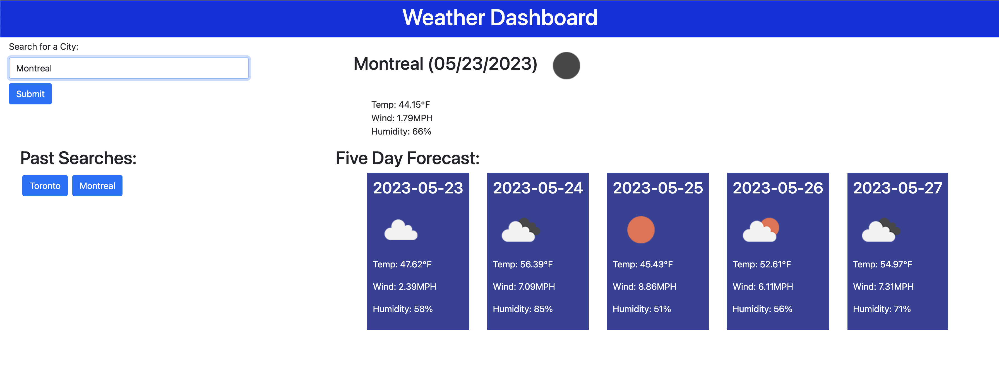

# my-weather-dashboard

## Description

This is a weather app I wrote as part of UofT coding bootcamp's challenge for server side APIs.  The challenge was designed to practise our understanding of connecting to a server side API, pulling the data and creatting functions in our JavaScript to display that data in an organized way.  I learned not only how to connect to the API but also how to specifically target the parts of the API data I need to work with.  

## Usage

To use this app, simply input the name of a city you would like to see the current and future weather for.  Once you run the search, you will be shown the current weather of that city including temperature, wind speed and humidity.  Additionally, you will be shown the same weather data for the next five days.  Your searches will be saved and displayed as well.

 

Link to live page: https://sunderfire.github.io/my-weather-dashboard/

## License

Please refer to LICENSE

